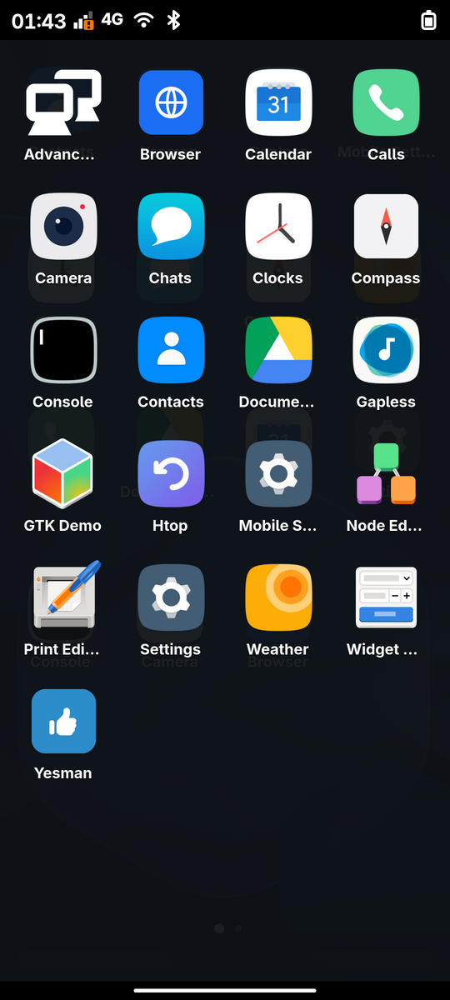

# Neo Launcher for Phosh

An Android-style home screen for phones running [Phosh](https://gitlab.gnome.org/World/Phosh/phosh), modelled on
[Neo Launcher](https://github.com/NeoApplications/Neo-Launcher) and Android's gesture navigation: a paged home
screen with a dock, an app drawer that follows your finger, icon packs and shapes, a One UI-style task view, and
back / home / recents gestures. Phosh keeps what it does well: the lock screen, notifications, quick settings, the
power menu, calls and the on-screen keyboard. Neo only replaces the app grid.

Tested on a POCO X3 NFC (Mobian sid + staging, Phosh 0.58, 1080×2400 at 120 Hz).

<p>




</p>

Home screen, app drawer, task view and the pattern lock screen.

The earlier GNOME Shell extension (for gnome-shell-mobile) is kept in [`old/`](old/).

## Features

**Home screen**: pages (4×5 by default), page dots, a dock of 4, your favourites as the first layout. Touch and hold
an icon and move it: it follows the finger, rests at a screen edge to turn the page, and drops on a cell or in the
dock. Touch and hold and let go: *App info* and *Remove*. An app may have several icons (a home shortcut of a dock
app); moving or removing affects the one icon you touched. Long press on empty space: *Launcher settings* and
*Wallpaper*. The wallpaper follows GNOME's background setting (including desktop-base XML themes) as soon as it
changes.

**App drawer**: swipe up anywhere on the home screen. The drawer's top comes to your finger and follows it; it
settles open or closed by distance and speed, and the drawer's icons fade in as it comes up. Touch and hold an app
and move it: the drawer goes and a copy lands on the home screen. A search field can be switched on.

**Gestures**: from the bottom edge, swipe up = home, swipe up and rest = the task view. From the left or right edge,
swipe inwards = back (an arrow pill follows the finger, as in the old Neo); in apps this sends Alt+Left.

**Task view** (One UI style): the current app shrinks into a card in the middle as the finger rests, the others
come in beside it with their icons, names and memory use. Tap a card to switch, swipe a card up to close it,
swipe sideways to scroll, *Close all* at the bottom, tap beside the cards or swipe up again for home.

**Launching**: a card grows from the icon to the whole screen and stays until the app's window is up, so the app
used before never flashes up. An app that already runs is switched to.

**Icons**: icon packs (the old Neo format: `pack.json`, `gnome-map.json`, `icons/`) and shapes (circle, squircle,
rounded square, teardrop, …), drawn one per idle tick so picking a pack never freezes the launcher.

**Screen lock** (Mobile Settings → device page): *Swipe* (no password), *Pattern* or *PIN*. A pattern is drawn and
confirmed as on Android and becomes the user's password: the dots joined in order as digits (1-4-7-8 is `1478`),
set through AccountsService after the current password. The lock screen then shows a 3×3 grid instead of the
keypad; a wrong pattern turns red.

**Screenshots**: power + volume down, as on Android; the volume popup is kept out of the picture.

**Mobile Settings**: a device page with the launcher choice (*Phosh* / *Neo*) and the screen lock, and *About* shows
the device name systemd-hostnamed reports (what fastfetch and GNOME Settings show).

## What is in here

| Path | What |
|------|------|
| [`neo-launcher/`](neo-launcher/) | The launcher: GJS, GTK 4, libadwaita, gtk4-layer-shell; runs as the user service `neo-launcher.service` |
| [`phosh/debian/patches/`](phosh/debian/patches/) | Patches for Debian's phosh 0.58.0: Neo as the home, the task view's D-Bus API, the screenshot combination, the pattern lock |
| [`ms-plugin-surya/`](ms-plugin-surya/) | The Mobile Settings device page (launcher, screen lock, the pattern dialog) |
| [`mobile-settings-patches/`](mobile-settings-patches/) | *About* shows the device name from systemd-hostnamed |
| [`build-debs.sh`](build-debs.sh) | Packages it all as Debian packages |
| [`docs/NOTES.md`](docs/NOTES.md) | Implementation notes: the traps met and why things are the way they are |

The Phosh patches are numbered in the order they were made:

* `0100` Neo takes the home: unfolding the home (the home bar, all apps closed, login) shows Neo, and the overview
  stays folded.
* `0101` an app launch ends when the app's window is mapped (no 30 s splash).
* `0102` restyled overview cards (kept for Phosh's own mode).
* `0103` the task view's data: `de.yesman.PhoshNeo` gives Neo the windows with their thumbnails
  (`GetWindows`, `Activate`, `Close`, `CloseAll`).
* `0104`, `0105` power + volume down takes a screenshot; the volume popup is hidden, not destroyed.
* `0106` the pattern lock (`de.yesman.neo lock-type = 'pattern'`).

## Building and installing

On the phone (arm64), with Debian's sources enabled:

```sh
# Phosh with the patches
apt-get source phosh && cd phosh-0.58.0
cp /path/to/neo-gnome/phosh/debian/patches/01*.patch debian/patches/
cat /path/to/neo-gnome/phosh/debian/patches/series >> debian/patches/series
dch -v 0.58.0-1+neo1 'Neo launcher.'
DEB_BUILD_OPTIONS="nocheck parallel=6" dpkg-buildpackage -b -uc -us

# Mobile Settings with the device page and the About patch
apt-get source phosh-mobile-settings && cd phosh-mobile-settings-0.58.0
cp -r /path/to/neo-gnome/ms-plugin-surya plugins/surya && echo "subdir('surya')" >> plugins/meson.build
echo 'usr/lib/*/phosh-mobile-settings/plugins/libms-plugin-surya.so' >> debian/phosh-mobile-settings.install
cp /path/to/neo-gnome/mobile-settings-patches/*.patch debian/patches/
echo about-device-from-hostnamed.patch >> debian/patches/series
apt-get install libcrypt-dev && dpkg-buildpackage -b -uc -us
```

Then, from a computer that reaches the phone over SSH, `./build-debs.sh OUT [PHONE]` packages the launcher
(`neo-launcher_*_all.deb`) and fetches the arm64 packages built on the phone. Install them, hold Phosh so an
upgrade does not bring back its own home screen (`apt-mark hold phosh phosh-common libphosh-0.45-0
phosh-mobile-settings`), and log out and in. The launcher is chosen in Mobile Settings, or with
`gsettings set de.yesman.neo launcher neo`.

Runtime dependencies: `gjs`, `gir1.2-gtk-4.0`, `gir1.2-adw-1`, `libgtk4-layer-shell0`,
`gir1.2-gtk4layershell-1.0`, `grim` (the task view's picture of the current app), `wtype` (back in apps),
`python3` (the task view's memory figures).

Icon packs go in `/usr/share/neo-launcher/iconpacks/` or `~/.local/share/neo-launcher/iconpacks/`.

## Settings

Everything is in the `de.yesman.neo` schema, most of it also in *Launcher settings*:

| Key | Default | |
|-----|---------|-|
| `launcher` | `'neo'` | `'neo'` or `'phosh'` (Phosh's own app grid) |
| `desktop-grid-columns`, `desktop-grid-rows` | 4, 5 | the home grid |
| `dock-num-icons` | 4 | |
| `drawer-grid-columns` | 4 | |
| `search-drawer-enabled` | false | the drawer's search field |
| `icon-pack`, `icon-shape` | `''`, `'system'` | |
| `lock-type` | `'pin'` | `'pin'`, `'pattern'` or `'swipe'` (set it from Mobile Settings: a pattern has to become the password) |

## License

GPL-3.0-or-later, see [LICENSE](LICENSE).
