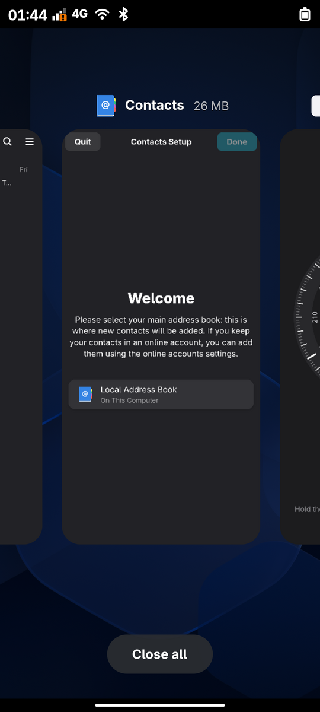
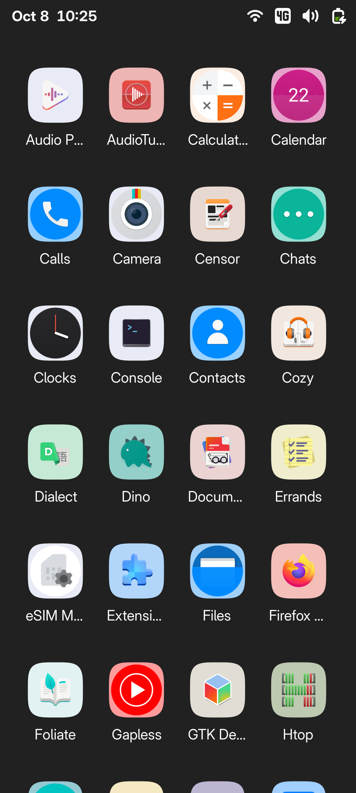
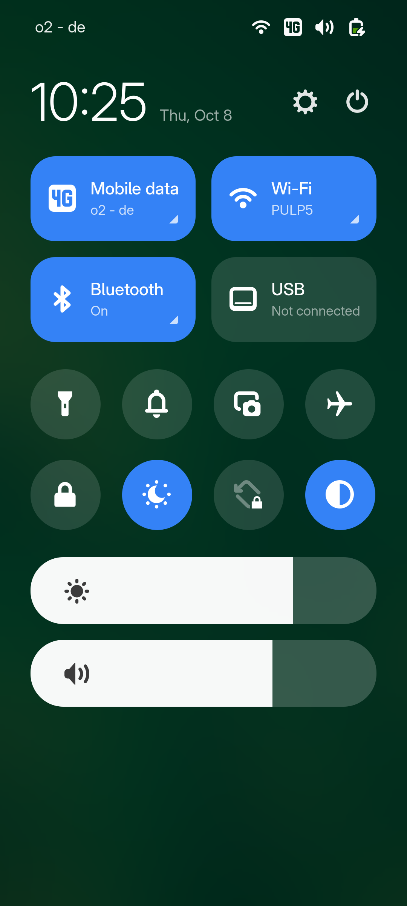
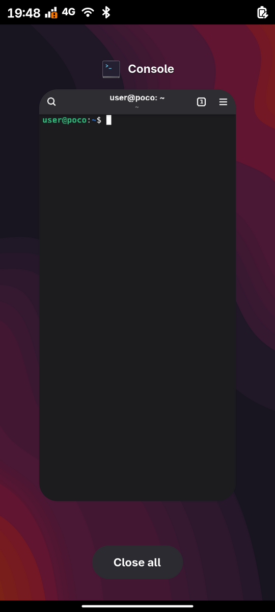
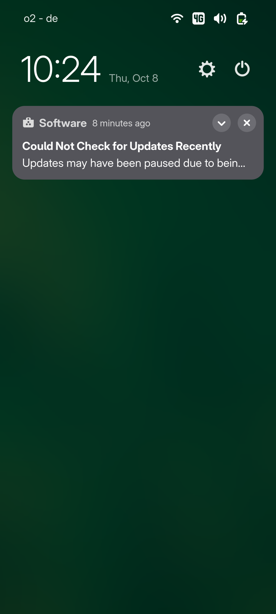
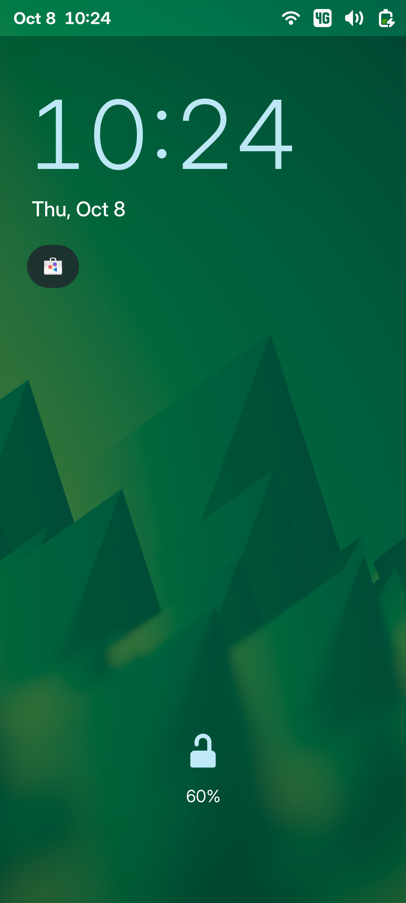
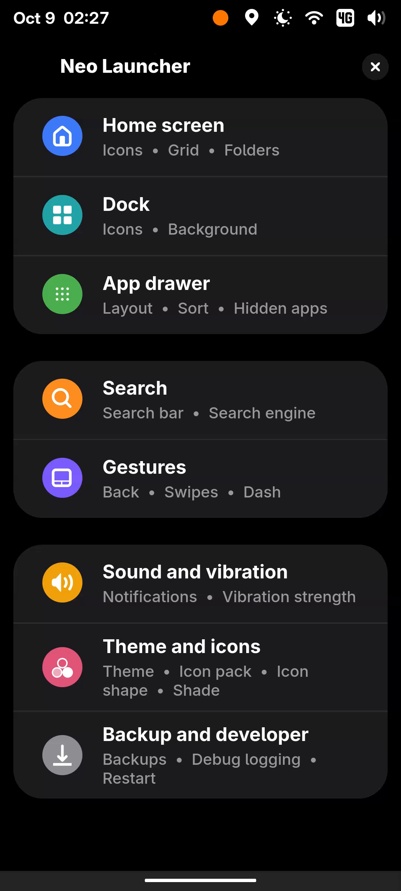
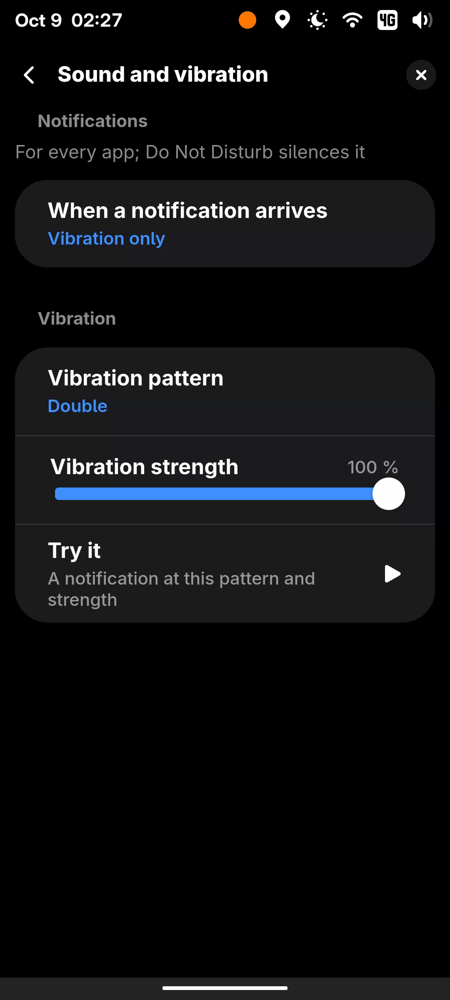

# Neo Launcher for GNOME Shell mobile

An Android-style home screen for phones running [gnome-shell-mobile](https://gitlab.gnome.org/verdre/gnome-shell-mobile)
(GNOME 48), modelled 1:1 on [Neo Launcher](https://github.com/NeoApplications/Neo-Launcher): paged
home screen with a dock, an app drawer that follows your finger, folders, icon packs and icon
shapes, a task switcher, and Android gesture navigation — as a Shell extension that replaces the
stock app grid, without patching the shell.

Tested on a Poco X3 NFC (postmarketOS edge, gnome-shell-mobile 48, 360×800 dp at 120 Hz).

<p>



</p>
<p>



</p>
<p>


</p>

Home screen, app drawer, Control Center, recent apps, notifications, lock screen, settings and the
Sound and vibration page (notification feedback, vibration pattern and strength) on a POCO X3 NFC.

## Features

**Home screen** — 4 icons per row by default (2–8 configurable), dock with up to 16 icons, page dots, Launcher3's
page swipe/fling/overscroll physics, wallpaper parallax, default layout seeded from your favourites,
light/dark/black themes, notification dots and counts from the message tray.

**Long press & drag** — icon popup (app actions from the `.desktop` file, Customize, Remove/Hide,
App info, Uninstall), empty-space popup (Wallpaper & style, Edit Home Screen, Set as Home Screen,
Apps list, Home settings). Drag to reorder, make folders by dropping one icon on another, dock
drop (swaps when the dock is full), Remove bar, spring-loaded pages, page turn at the edge,
drawer → home and folder → home drags. Haptics through `fbcli`. App info opens the app in
the store it was installed from; Uninstall removes it directly.

**App drawer** — swipe up from the home (the sheet follows the finger, 60 % commit; the home
fades out over the whole swipe and the drawer's icons fade in with it), optional search bar (off by
default) with
prefix/word/fuzzy matching and a web fallback with a choice of engines, Neo's dark sheet with a
fast-scroll thumb (drag it for the letter bubble), vertical and paged layouts, A→Z / Z→A / most
used / by colour / last installed sorting, a suggestions row, hidden apps.

**Folders** — 2×2 preview, open/close scale animation, 3×3 grid (2–5), inline rename.

**Icon packs & shapes** — any Android icon pack can be imported from its APK or XAPK
(`tools/import-iconpack.py`); the launcher maps GNOME apps to the pack's drawables by package
table and by the pack's generic names. Twelve icon shapes (squircle by default). Pack icons are
re-wrapped on their own edge colour when a shape is chosen; apps a pack does not cover get the
pack's back/mask/upon layers (Android pack convention) or a tinted shaped background. Everything
is rendered once with cairo and cached as PNG.

**Gestures** — swipe up (drawer), swipe down (notifications), double tap (Dash), touch
and hold (options), dock swipe up (global search), pinch in (Edit Home Screen) / pinch out, and
Android gesture navigation: drag in from the left or right edge to go **back** (arrow pill; closes
folder, drawer or search on the launcher, sends Alt+Left to the focused app).

**Recents** — bottom-edge swipe: a flick goes home, a slow release shows the task list as cards
over the dimmed wallpaper; slide between tasks, tap to return, swipe up to close, Close all.

**Dash** — double tap opens Neo's bottom sheet: Wi-Fi, Bluetooth, airplane mode, location and
auto-rotation controls plus actions (wallpaper, home settings, volume, device settings, manage
apps, all apps, sleep, audio player); pick and order them under Gestures › Dash.

**Lock screen and screen timeout** — the lock screen turns the screen off after 15 s, and the
home or an app after 2 min idle; both fade out over 1 s first. The power button locks and wakes.

**Control Center and shade** — Neo's own Control Center (Wi-Fi, Bluetooth, toggles, brightness and
volume sliders) as a MIUI-style shade, or GNOME's own quick settings (Theme › Notifications shade).

**Power menu** — Restart shows the boot animation with "Restarting" until the phone goes down.

**Apps opened from anywhere come forward** — on gnome-shell-mobile the home is the overview, and an
app opened without going through it (GNOME's quick settings, a notification, another app) used to
open and take the focus underneath it. A new focused window, a running app activated through the
shell, or a window asking for attention right after a launch is now brought forward, once.

**Notification sound and vibration** — GNOME plays only a sound an app attaches to its notification,
and next to none do. The launcher gives every app's new notification feedbackd's notification
feedback: sound and vibration, vibration only or nothing, in one of four vibration patterns (Short,
Double, Triple, Long) at an adjustable strength. Silent in Do Not Disturb, for apps whose sound is
off, and while that app is in front. The status LED breathes (fades in and out, in the kernel's LED pattern
trigger) while the screen is off and something is unread.

**Desktop apps fit the phone** — a window whose minimum width is wider than the screen (desktop Chromium's
is about 500 px on a 360 px phone) is shown scaled to exactly the screen's width; touches land where it is
drawn. A window that is only wide for the moment is asked to fit first.

**Keyboard on a tap** — the on-screen keyboard rises for a tap into a text field, not because an app focused
one while opening (Android's rule). Qt apps report their caret a moment after asking for the keyboard; the
policy waits for it instead of holding their keyboard back.

**Settings** — the Extensions preferences window, styled after One UI settings (big touch rows, the
title in the header): Home screen, Dock, App drawer (incl. hidden apps), Search (engine picker),
Gestures and Dash, Sound and vibration (notification feedback, vibration pattern and strength, Try
it), Theme and icons (theme, icon pack, icon shape with previews, notifications shade), Backups
(settings + layout as JSON), and a Developer group with debug logging and a restart.

## Install

### As a package (Nura, postmarketOS and other Alpine-based phones)

`packaging/alpine/` holds an `APKBUILD`. The package installs the extension system-wide under
`/usr/share/gnome-shell/extensions/`, puts the settings schema into the system schema directory
(the glib trigger compiles it), and ships a GSettings override that turns the extension on for
every user who has not written their own extension list. Nothing else is needed: log out and back
in (or reboot) and the home screen is Neo. Disabling the extension in *Extensions*, or removing the
package, brings the stock app grid back.

A ready-built package is in `dist/` (`neolauncher-gnome-shell-1.0.0-r8.apk`, signed with
`dist/pulp-6ac42643.rsa.pub`):

```sh
sudo cp dist/pulp-6ac42643.rsa.pub /etc/apk/keys/
sudo apk add dist/neolauncher-gnome-shell-1.0.0-r8.apk
# or, without trusting the key: sudo apk add --allow-untrusted dist/neolauncher-gnome-shell-1.0.0-r8.apk
```

To build the package yourself you need an Alpine box or the phone itself with `alpine-sdk`, a key
(`abuild-keygen -a -n -i`) and your user in the `abuild` group:

```sh
make dist                                          # neolauncher-gnome-shell-<ver>.tar.gz
PHONE=user@phone packaging/alpine/build-on-device.sh   # copies tarball + APKBUILD over, runs abuild -r, fetches the .apk
```

A copy of the extension in `~/.local/share/gnome-shell/extensions/` (what `install.sh` writes for
development) shadows the packaged one at the next login.

### As a plain extension

```sh
make pack                      # builds neolauncher@yesman.de.shell-extension.zip
make install                   # gnome-extensions install --force … (then log out and back in)
gnome-extensions enable neolauncher@yesman.de
```

The extension targets gnome-shell-mobile 48 (`session-modes: ["user"]`). On a desktop GNOME 48 it
loads but the mobile overview it replaces is not there, so it does nothing useful.

### Icon packs

Icon packs are folders under `~/.local/share/neolauncher/iconpacks/<id>/`, produced from an
Android icon pack:

```sh
python3 -m venv venv && venv/bin/pip install pyaxmlparser
venv/bin/python tools/import-iconpack.py ~/Downloads/some-icon-pack.apk h2o --title "H2O"
rsync -a iconpacks/ ~/.local/share/neolauncher/iconpacks/
```

The importer prints which GNOME apps it could map (edit `GNOME_TO_ANDROID` in the script to add
yours). Pick the pack under Theme › Icon pack. OnePlus O2, H2O and MIU 11 are known to import
cleanly; packs that ship as a stripped base APK (no `appfilter.xml`) cannot be used.

## Development

```sh
make check                     # parse every module with node
./install.sh                   # rsync to the phone and hot-reload over D-Bus (edit PHONE=)
./tools-eval.sh 'return home.currentPage'   # run JS inside the shell (ext, home, Main in scope)
```

`extension.js` is loaded once per login; the launcher itself lives in `launcher/*.js` and is
re-imported through a cache-busting `?gen=N` on every reload, so no logout is needed while
developing. `NEO-SPEC.md` is the behavioural spec distilled from Neo Launcher's sources
(metrics, animations, settings tree) and `SHELL-RESEARCH.md` documents how the mobile shell's
overview is taken over.

## Status

See `NEO-SPEC.md` §1 for the full inventory. Not yet ported: home-screen widgets and the smartspace
row (no AppWidget on Linux), drawer categories and tabs (fall back to the vertical list), folder
cover mode and paging beyond 9 items, search suggestions, per-app icon overrides.

## Quiet U-Boot for the POCO X3 NFC

`u-boot/` holds the boot loader this launcher was developed on: a quiet U-Boot that leaves the
panel dark and draws a small gear under the POCO logo. It includes the flashable image, the
original image for rollback, and the patch and config to build it. See `u-boot/README.md`.

## License

GPL-3.0, like Neo Launcher. This is an independent re-implementation of Neo Launcher's design for
GNOME Shell; it contains no code from the Android project.
